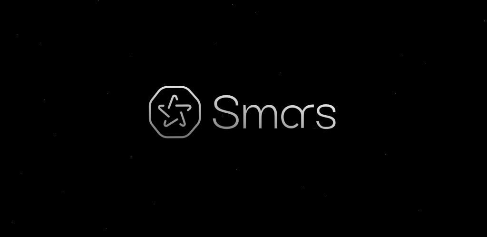

# Smars Public Assets

Public visual assets for the Smars platform.

A centralized collection of images, icons, and graphics (PNG, SVG) used across the product, ensuring consistency, clarity, and production-ready usage.

<p align="center">
  
</p>

---

## Overview

This repository contains the official assets that define the visual identity of Smars.

It is designed to be simple, reliable, and easy to use—whether you’re building with Smars or showcasing it.

---

## Contents

* Logos and brand marks
* Icons and UI elements
* Illustrations and graphics
* Product UI assets


## Usage

You are free to use these assets to **promote and showcase Smars**, including:

* Videos, tutorials, and reviews
* Blog posts and educational content
* Community and developer projects

---

## Brand Guidelines

Use assets as provided to maintain a consistent and recognizable identity.

**Do**

* Use official files from this repository
* Keep visuals clear and properly spaced
* Use on clean, high-contrast backgrounds

**Don’t**

* Alter, stretch, or distort assets
* Modify colors or redesign elements
* Use in misleading or unclear contexts

---

## Attribution

Attribution is not required.

If you’re building with Smars, mentioning it (e.g., *“Powered by Smars”*) is appreciated but optional.

---

## Structure

```
/logos            Core brand identity assets  
/banners          Marketing and promotional visuals  
/brand-assets     Extended brand visuals and themes  
/press-kit        Ready-to-use media and company info  
```

---

## License

### Smars Public Assets License

© 2026 Smars. All rights reserved.

**Allowed**

* Promotion and showcasing of Smars
* Content creation (videos, articles, tutorials)
* Educational and community use

**Not Allowed**

* Use in unrelated products or services
* Implying endorsement or partnership
* Misleading modifications of branding
* Redistribution as standalone asset packs

**Commercial Use**
Allowed only when directly promoting Smars.
All other use requires permission.

**Disclaimer**
Assets are provided “as is”, without warranty of any kind.

---

## Contact

[hello@smars.app](mailto:hello@smars.app)

---

Built for clarity. Designed to be shared.
